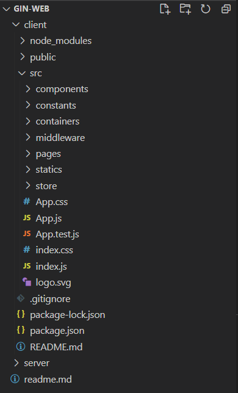
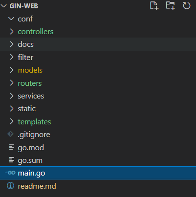

# Blog
Crispy's Blog

React and Go with Clean-Architecture

http://crispyblog.kr/

## Project Stack

### frontend (client)
- React
- React Router
- Redux
- GraphQL (Apollo)
- styled components & material-ui

### backend (server)
- Go : Gin Framework with CleanArchitecture
- MongoDB ~~Mysql / GORM~~
- GraphQL
- JWT / SMTP

## Version History
<details> 
    <summary> 👉 Click Me  ( Expand Detail Tag ) </summary>

### Blog (tag : v0.3.4)
- CI/CD
    - jenkins
        - 서버사양으로 인해 빌드가 너무 오래 걸림
        - 서버업그레이드 까지는 일단 도커 수작업 : 로컬PC에서 빌드 -> docker-hub push -> server에서 pull
    - docker
        - server 도커로 구동시, kakao 로그인 문제 발생

### Blog (tag : v0.3.3.3)
- header 버그 수정

### Blog (tag : v0.3.3.2)
- Edit Metatag
- Add secret page

### Blog (tag : v0.3.3.1)
- Edit CSS

### Blog (tag : v0.3.3)
- SEO
    - search console
        - sitemap.xml 
        - robots.txt
    - meta tag
        - react-helmet-async
    - pre-render
        - 구글봇은 JS까지 렌더링하여 크롤링하도록 업그레이드 되었다. 이제는 굳이 pre-render 가 필요없는 것으로 보인다.
        - Static Generation : 정적생성
            - 정적 라우팅에 대한 처리 : 빌드시점에 명시한 url 크롤링 → 페이지별 index.html 생성
            - 동적 라우터에 대한 처리 : 웹팩기반으로 빌드시점에 동적페이지들을 로드 → 크롤링 → index.html 생성 → url 매핑 필요 (simple is best 에서 벗어나므로 배제하였다)
            - react-snap / prerender-spa-plugin
        - Server Side Rendering : 서버 사이드 렌더링
            - Next.js or Gatsby : server 를 Go로 구축 하였기에 배제하였다.

### Blog (tag : v0.3.2.1)
- 도메인 등록
    -  ddns: noip → dns: 가비아

### Blog (tag : v0.3.2)
- Edit CSS
- Change Logo & Favicon
- Add URL Constant

### Blog (tag : v0.3.1)
- 임시배포(naver cloud)
    - docker
    - nginx
    - go cross os build

### Blog (tag : v0.3.0)
- 검색 기능 보완
    - transition을 동작을 위해 css 수정
        - display: none → visiblity : hidden
    - 태그 자동입력
    - Apllo Issue : [ObservableQuery with this id doesn't exist: id](https://github.com/apollographql/apollo-client/issues/4114)

### Blog (tag : v0.2.9)
- 검색 기능 구현
    - Apllo Issue : [ObservableQuery with this id doesn't exist: id](https://github.com/apollographql/apollo-client/issues/4114)

### Blog (tag : v0.2.8)
- Infinite Scroll(NewstViewer) : cursor 방식으로 변경
    - 특정 상황을 제외하고서는 cursor 방식의 pagination을 사용하는 것이 바람직하다.

### Blog (tag : v0.2.7)
- CORS Middleware : dropzone initial file 문제로 default 값 설정
- Infinite Scroll(NewstViewer) : offset 방식


### Blog (tag : v0.2.6)
- component 분리
    - container components
    - presentational components
- 저장소 이름 변경
    - gin-web → Blog

### Blog (tag : v0.2.5)
- Multiple CORS
- kakao login 구현
    - server side working : kakaoAPI / JWT / SMPT
- 댓글 구현
    - refetch : cache-first (cache-and-network 으로 동작시, 전체렌더링이 일어난다)
- Add detail to style


### Blog (tag : v0.2.4)
- Markdown
    - edit / delete 기능 구현
    - MDWriter : editMode 와 writeMode 로 분류
    
### Blog (tag : v0.2.3)
- privacy setting switch
    - public / private
    - apollo useQuery option : fetchPolicy
        - ★ cache-first (default)
        - cache-only
        - ★ cache-and-network
        - network-only
        - no-cache
        - standby
- Email Sign In 구현
    - useLazyQuery
    - SMTP / JWT
    - ★ Graphql 에서의 접근 제한 ★
    ```palin
    1) Apollo Client : credentials: 'include' 옵션으로 CORS 에서도 HttpOnly Cookie를 전송가능하게 설정한다.
    2) CORSMiddleware : 상기 설정으로 더 이상  Header 의 Access-Control-Allow-Origin 옵션을 와일드카드(*)로 사용해서는 안된다.
    3) schema의  Resolve 에 매핑된 Resolver 는 오직 ResolveParams 만을 파라미터로 받을 수 있기에,  직접적으로 gin.context 를 넘기지 못한다.
    즉, cookie resolver 하위 로직에서 cookie 사용이 불가하다.
    이를 위해, graphql.ResolveParams 의 context 로 Srtuct를 넘겨주는 CookieMiddleware 를 구현하였다.
    ```
- Admin state
    - Current User 를 cookie 토큰으로 확인하여, admin 여부를 판별한다.
    - admin 인 경우에만, 글쓰기 및 관련 메뉴가 활성화 된다.
- definition tip
    - Authentication(authenticate) = login + password (who you are)
    - Authorization(authorize) = permissions (what you are allowed to do)

### Blog (tag : v0.2.2)
- Post(article) and MDE
    - article max-width 동적 CSS 적용
    - post validation
    - publish dialog : thumbnail upload / 소개 / 공개, 비공개
    - mde resize image helper 추가
    - card css 수정

### Blog (tag : v0.2.1)
- Markdown : server image upload 구현

### Blog (tag : v0.2.0)
- client :
    - router page 구조 변경/ header subject 동작 개선 / 버그 수정
    - MarkDown
        - editor : react-simplemde-editor
        - renderer : react-markdown
            - remark-gfm / rehype-raw /SyntaxHighlighter / style 정의
    - snackbar 구현 : notistack
    
- server :
    - MongoDB id 대신 _id 사용
    - sequence 구현
        1. create sequence collection
        2. auto increament 
        3. type : int64 / NumberLong()
        4. findOneAndUpdate, findOneAndReplace ← ~~findAndModify~~

### Blog (tag : v0.1.9)
- testData 대신 모두 MongoDB 데이터로 변경

### Blog (tag : v0.1.8)
- server : CORS Middleware 생성
- client : yarn add apollo-boost graphgql @react-apollo
    - Menu - server data load

### Blog (tag : v0.1.7)
- server
    - AS-IS : Mysql / RESTful
    - TO-BE : MongoDB / GraphQL
- GraphQL
    - graphql : ggithub.com/graphql-go/graphql
    - graphql hadnler : gogithub.com/graphql-go/handler
    - ~~gqlgen : github.com/99designs/gqlgen~~
        - gqlgen 은 schema 만으로 generated 작업을 수행해주어 매우 편리하다.
        - 다만, 나의 목적에 부합하지 않았다. 정해진 규격이 있어서 오히려 커스텀하는데 비용이 소비된다.
    - cleanArchitecutre
        - repository - service - resolver  - schema - gql handler 구조
    - bson
        - bson.D / bson.M / bson.E / bson.A

    ```plain
    [or search]
    data, err := r.db.Find(context.TODO(), bson.M{"$or": []bson.M{{"title": title}, {"id": id}}})
    
    [like search]
    data, err := r.db.Find(context.TODO(), bson.M{"title": bson.M{"$regex": title}})

    [like search + 대소문자 구분 X]
    data, err := r.db.Find(context.TODO(), bson.M{"title": bson.M{"$regex": title, "$options": "i"}})

    ```

### Blog (tag : v0.1.6)
- server : db connection 방식 변경
    - The connection is only done once

### Blog (tag : v0.1.5)
- VanillaJS 코드를 React-Router-dom Hook 으로 대체
    - page - container - component 연결

### Blog (tag : v0.1.4)
- SpeedDialog 추가

### Blog (tag : v0.1.3)
- header subject 동작 개선
- useEffect(componentWillUnmount) 에서의 removeEventListener
- catching bug O_O

### Blog (tag : v0.1.2)
- Hook 으로 대체
    - connect -> useSelector, useDispatch
    - store.subscribe -> useEffect
- Hook 최적화
    - useSelector
        - a) 독립 선언
        - b) shallowEqual
    - useEffect
        - 의존성배열없이 componentDidMount 처럼 동작 하기위한 변수(꽁수?) 추가

### Blog (tag : v0.1.1)
- useEffect expression
```plain
    - componentDidMount
        useEffect(() => {
            do();
         }, []);

    - componentDidUpdate
         useEffect(() => {
            do();
         }, [state]);

    - componentWillUnmount 
        useEffect(() => {
            do();
            return () => {
                finish();
            }
         });
```

### Blog (tag : v0.1.0)
- router 및 SideBar 추가 작업

### Blog (tag : v0.0.9)
- redux 및 sidebar hidden/expand 작업

### Blog (tag : v0.0.8)
- 블로그로 컨셉 변경
    - 뼈대 생성
    - styled component 기반에 약간의 material-ui 를 곁들인...

### Blog (tag : v0.0.7.2)
- Using yarn instead of npm

    

### Blog (tag : v0.0.7.1)
- Refactoring : Folder Structure

### Blog (tag : v0.0.7)
- kakao api Login 구현
    - kakao 토큰 발급확인 후, 자체 JWT 로그인 진행
- Logout 구현

### Blog (tag : v0.0.6)
- 로그인 기능 구현 완료
    - signup 후 email 인증 (google uuid를 인증키값으로 사용)

### Blog (tag : v0.0.5)
- JWT을 통한 로그인 적용
    - http only Cookie
    - *CSRF Defence 대책 필요*

### Blog (tag : v0.0.4)
- CleanArchitecutre 적용
- DB 연동
    - gorm / mysql / read config env
    - *gorm 의 TableName 메서드가 필요이상으로 여러번 호출되는 문제를 보임*

### Blog (tag : v0.0.3)
- CleanArchitecture 로 변경중
- ajax 로 동작하는 article 제거버튼 추가

### Blog (tag : v0.0.2)
- request의 accept header 별로 처리해줄 redner 함수 추가
- middleware 디렉토리 생성 ( gin.Default() 에서 gin.New() 로 변경 )
    - Logging 추가
    - basic auth 추가
    - ~~req/res 디버깅을 위한 gindump 추가~~

### Blog (tag : v0.0.1)
- 각 언론사의 뉴스기사를 스크랩하여, 원하는 키워드별로 정리해서 보여주는 website 계획
    - 하나의 키워드에 대하여 여러 언론사의 기사를 비교하여 볼수 있다.
- directorty  재구성
    - router / controller / service / model
    - main router 에서 각 router group을 init 하도록 구성
    
    

## initial commit
- directory structure 임시 생성

    

</details>