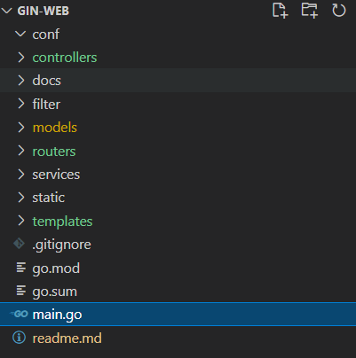

# Gin-Web

gin framework 로 만드는 website

## Gin-Web (tag : v0.0.1)
- 각 언론사의 뉴스기사를 스크랩하여, 원하는 키워드별로 정리해서 보여주는 website 계획
    - 하나의 키워드에 대하여 여러 언론사의 기사를 비교하여 볼수 있다.
- directorty  재구성
    - router / controller / service / model
    - main router 에서 각 router group을 init 하도록 구성
    
    

## initial commit
- directory structure 임시 생성

    

