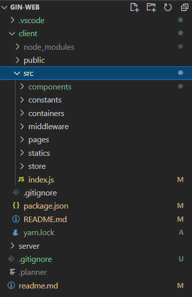

# Gin-Web
Go and React Web App

## Project Stack
### frontend
- React
- React Router
- Redux

### backend
- Go
    - Gin Framework by CleanArchitecture
    - GROM
    - JWT / SMTP
- Mysql

## Version History

    
 👉 Click Me  ( Expand Detail Tag )

### Gin-Web (tag : v0.0.9)
- redux 및 sidebar hidden 작업

### Gin-Web (tag : v0.0.8)
- 블로그로 컨셉 변경
    - 뼈대 생성
    - styled component 기반에 약간의 material-ui 를 곁들인...

### Gin-Web (tag : v0.0.7.2)
- Using yarn instead of npm

    

### Gin-Web (tag : v0.0.7.1)
- Refactoring : Folder Structure

### Gin-Web (tag : v0.0.7)
- kakao api Login 구현
    - kakao 토큰 발급확인 후, 자체 JWT 로그인 진행
- Logout 구현

### Gin-Web (tag : v0.0.6)
- 로그인 기능 구현 완료
    - signup 후 email 인증 (google uuid를 인증키값으로 사용)

### Gin-Web (tag : v0.0.5)
- JWT을 통한 로그인 적용
    - http only Cookie
    - *CSRF Defence 대책 필요*

### Gin-Web (tag : v0.0.4)
- CleanArchitecutre 적용
- DB 연동
    - gorm / mysql / read config env
    - *gorm 의 TableName 메서드가 필요이상으로 여러번 호출되는 문제를 보임*

### Gin-Web (tag : v0.0.3)
- CleanArchitecture 로 변경중
- ajax 로 동작하는 article 제거버튼 추가

### Gin-Web (tag : v0.0.2)
- request의 accept header 별로 처리해줄 redner 함수 추가
- middleware 디렉토리 생성 ( gin.Default() 에서 gin.New() 로 변경 )
    - Logging 추가
    - basic auth 추가
    - ~~req/res 디버깅을 위한 gindump 추가~~

### Gin-Web (tag : v0.0.1)
- 각 언론사의 뉴스기사를 스크랩하여, 원하는 키워드별로 정리해서 보여주는 website 계획
    - 하나의 키워드에 대하여 여러 언론사의 기사를 비교하여 볼수 있다.
- directorty  재구성
    - router / controller / service / model
    - main router 에서 각 router group을 init 하도록 구성
    
    

## initial commit
- directory structure 임시 생성

    

